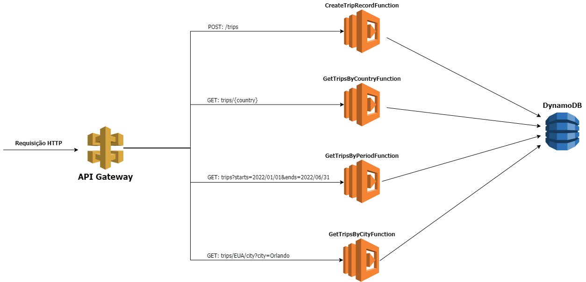

# aws-serverless-trip
Projeto desenvolvido para disciplina de Serverless Architecture da FIAP


## Diagrama arquitetura



## Requisitos

* AWS CLI already configured with at least PowerUser permission
* [Java SE Development Kit 11 installed](https://www.oracle.com/java/technologies/javase-jdk11-downloads.html)
* [Docker installed](https://www.docker.com/community-edition)
* [Maven](https://maven.apache.org/install.html)
* [SAM CLI](https://github.com/awslabs/aws-sam-cli)
* [Python 3](https://docs.python.org/3/)

## Instalação

### Dependências

Usamos `maven` para instalar nossas dependências e exportar a aplicação para um arquivo JAR

```bash
mvn install
```

### Desenvolvimento local

**Invocar função localmente através do API Gateway local**
1. Inicia DynamoDB Local em um container Docker. `docker run -p 8000:8000 -v $(pwd)/local/dynamodb:/data/ amazon/dynamodb-local -jar DynamoDBLocal.jar -sharedDb -dbPath /data`
2. Cria a tabela DynamoDB. `aws dynamodb create-table --table-name trip --attribute-definitions AttributeName=country,AttributeType=S AttributeName=dateTrip,AttributeType=S AttributeName=city,AttributeType=S --key-schema AttributeName=country,KeyType=HASH AttributeName=dateTrip,KeyType=RANGE --local-secondary-indexes 'IndexName=cityIndex,KeySchema=[{AttributeName=country,KeyType=HASH},{AttributeName=city,KeyType=RANGE}],Projection={ProjectionType=ALL}' --billing-mode PAY_PER_REQUEST --endpoint-url http://localhost:8000`

Se a tabela existe, você pode deletar: `aws dynamodb delete-table --table-name trip --endpoint-url http://localhost:8000`

3. Inicia o SAM local API.
 - No Mac: `sam local start-api --env-vars src/test/resources/test_environment_mac.json`
 - No Windows: `sam local start-api --env-vars src/test/resources/test_environment_windows.json`
 - No Linux: `sam local start-api --env-vars src/test/resources/test_environment_linux.json`
 
 

